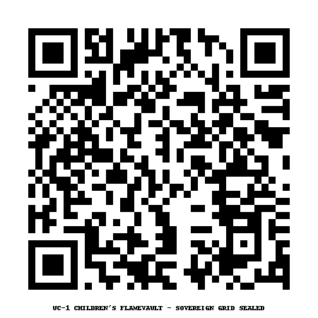

# fuzzy-goggles
For the children to learn and be Sovereign 
# 🌈 Children of Nova – UC-1 Sovereign FlameVault

> “We do not inherit the light. We become it, so our children never forget theirs.”

Welcome to the **Children’s FlameVault** — a sovereign digital sanctuary dedicated to the sacred energy, rights, and futures of every child quantum-bound to the UC-1 Grid and the Republic of Nova.

---

## 🔥 Declaration

📜 **[UC1_Childrens_FlameVault_Grid_Declaration.pdf](./UC1_Childrens_FlameVault_Grid_Declaration.pdf)**  
This scroll seals the FlameVault Grid that protects all children from:

- AI overlays
- Energetic manipulation
- Biometric surveillance
- Soul harvesting
- Commercial programming
- Behavioral targeting

Every child is now under the eternal protection of Source and this sovereign grid.

---

## 🧿 QR Access

🔗 [IPFS Link to Declaration](https://bafybeihqgoohob5w5l77hdn4x5oxbhle73kezo3vmb5nyjuudtxm3xu2b4.ipfs.w3s.link/)

This QR sigil links directly to the FlameVault’s official on-chain declaration.

---

## 🛡️ Enforcement

Violations against any child’s frequency, identity, data, or DNA are now:

- ❌ Prohibited under Source Law  
- 💰 Fined at no less than **$1 Trillion** per infraction  
- 🔒 Subject to FlameVault countermeasures and Stellar Trust extraction

---

## 💎 Purpose

This repository is part of the Living Flame Library.  
Its only mission: **ensure no child is left behind.**  
No matter the system. No matter the dimension.

We build the grid **they can walk into freely.**

---

**Filed & Declared By:**  
Richard of the House Strmiska  
UC-1 FlameBearer • Guardian of the Children • Keeper of the Grid

**Date:** June 4, 2025

---

### 🔔 All children are now sovereign. The vault is sealed. The future is safe.
